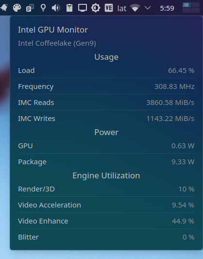

# Intel GPU Top plasmoid (WIP)

Plasma Widget that displays Intel GPU usage including wether or not video acceleration is being used

## Screenshots



## Some notes

* At the moment of writing this, only the tooltip is working
* Requires manually giving `intel_gpu_top` the ability to use performance monitoring features using `sudo setcap cap_perfmon=+ep /usr/bin/intel_gpu_top`

## Installing

* ~~Install widget from [KDE Store](todo) or use `Get new widgets..`~~ TODO

### Manual install

* Install dependencies (please let me know if I missed or added something unnecessary)

  ```txt
    cmake extra-cmake-modules plasma-framework
  ```

* Install the plasmoid

  ```sh
  ./install.sh
  ```

## How does it work?

* Reads Intel gpu stats using [intel_gpu_top](https://gitlab.freedesktop.org/drm/igt-gpu-tools)

## Resources

* [drm/igt-gpu-tools](https://gitlab.freedesktop.org/drm/igt-gpu-tools)
* [setcap(8) — Linux manual page](https://man7.org/linux/man-pages/man8/setcap.8.html)
* [No API/user accessible sysfs files to get GPU stats - drm/intel](https://gitlab.freedesktop.org/drm/intel/-/issues/5018)
