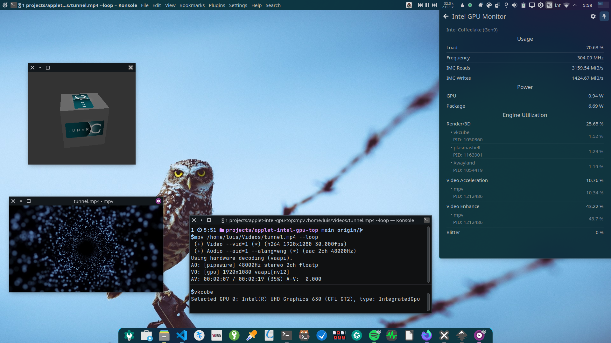

# Intel GPU Monitor

<div align="center">

[](https://store.kde.org/p/2128477)

Plasma Widget that displays Intel GPU usage including wether or not video acceleration is being used

</div>

## Screenshots



<details>
    <summary>Settings</summary>


Tooltip


</details>

## Requirements

* [intel-gpu-tools](https://gitlab.freedesktop.org/drm/igt-gpu-tools) package

* Giving `intel_gpu_top` the ability to use performance monitoring features using `sudo setcap cap_perfmon=+ep /usr/bin/intel_gpu_top` every reboot, or you can use the following Systemd Unit

1. Create `/etc/systemd/system/setcap_intel_gpu_top.service` with the following:

    ```ini
    [Unit]
    Description=Set intel_gpu_top perfmon capabilities
    After=graphical.target

    [Service]
    ExecStart=/sbin/setcap cap_perfmon=+ep /usr/bin/intel_gpu_top
    Type=oneshot
    RemainAfterExit=yes

    [Install]
    WantedBy=graphical.target
    ```

2. Start & enable the service

    ```sh
    sudo systemctl enable --now setcap_intel_gpu_top.service
    ```

3. In systems such as Ubuntu, performance events monitoring are disabled by default. For `intel_gpu_top` to work without root you need to set `/proc/sys/kernel/perf_event_paranoid` to 2. Otherwise you may get an error like this:

   ```sh
    $ intel_gpu_top
    Failed to initialize PMU! (Permission denied)
    ...
   ```

    To solve this, lower the paranoid level to 2 by running `sudo sysctl kernel.perf_event_paranoid=2`

    * To make it permanent create the file `/etc/sysctl.d/99-sysctl-paranoid.conf` with the following content

        ```ini
        kernel.perf_event_paranoid = 2
        ```

    Finally, run `intel_gpu_top` to verify it works

## Current & planned features

> [!IMPORTANT]
> Depending on the GPU model, some features may not be available, unsupported features will show a -1 value in the widget view. I will hide them in a later version.

* [x] Show General usage
  * [x] Load, Frequency, Power consumption
  * [x] Usage per engine (`Render/3D`, `Video & VideoEnhance`, `Blitter`)
* [x] Show top clients (program names) per engine
  * [x] Custom max clients (program names) to show in engine utilization
* [x] GPU selection
* [ ] Custom icons support
* [x] Show current engine load
  * [x] With badge or text
  * [x] With color dot
* [x] Custom engine utilization threshold to update icons
* [x] Show intel_gpu_top isn't available or doesn't have perfmon capabilities set

## Installing

### KDE Store

1. **Right click on the Panel/Desktop** > **Add or manage widgets** > **Add new...** > **Download new...**
2. **Search** for "**Intel GPU Monitor**", install and add it to your Panel/Desktop.

* Install from [KDE Store](https://store.kde.org/p/2101680) or use `Get new widgets..`
  * [Plasma 5 version](https://store.kde.org/p/2101680)
  * [Plasma 6 version](https://www.pling.com/p/2128477)

### Manual install

> [!IMPORTANT]
> The `main` branch was updated to support Plasma 6, to install from source in plasma 5 run `git checkout kf5` before the install script.

1. Install these dependencies (please let me know if I missed or added something unnecessary)

    ```txt
    cmake extra-cmake-modules libplasma intel-gpu-tools
    ```

2. Run `./install.sh`

## Support the development

* If you like the project please consider donating/sponsoring this and [my other open source work](https://github.com/luisbocanegra?tab=repositories&q=&type=source&language=&sort=stargazers)

  [](https://github.com/sponsors/luisbocanegra) [](https://www.buymeacoffee.com/luisbocanegra) [](https://liberapay.com/luisbocanegra/) [](https://www.paypal.com/donate/?hosted_button_id=Y5TMH3Z4YZRDA)

* [Give it a star on GitHub](https://github.com/luisbocanegra/plasma-intel-gpu-monitor)
* Rate/review in the [KDE Store](https://store.kde.org/p/2130967)

## Resources

* [IGT GPU Tools](https://gitlab.freedesktop.org/drm/igt-gpu-tools)
* [Perf events and tool security — The Linux Kernel documentation](https://www.kernel.org/doc/html/latest/admin-guide/perf-security.html)
* [capabilities(7) - overview of Linux capabilities — Linux manual page](https://man7.org/linux/man-pages/man8/setcap.8.html)
* [setcap(8) - set file capabilities — Linux manual page](https://man7.org/linux/man-pages/man8/setcap.8.html)
* [No API/user accessible sysfs files to get GPU stats - drm/intel/issues](https://gitlab.freedesktop.org/drm/intel/-/issues/5018)

## Credits

* [Google LLC. / Pictogrammers](https://pictogrammers.com/library/mdi/) for the panel icons
