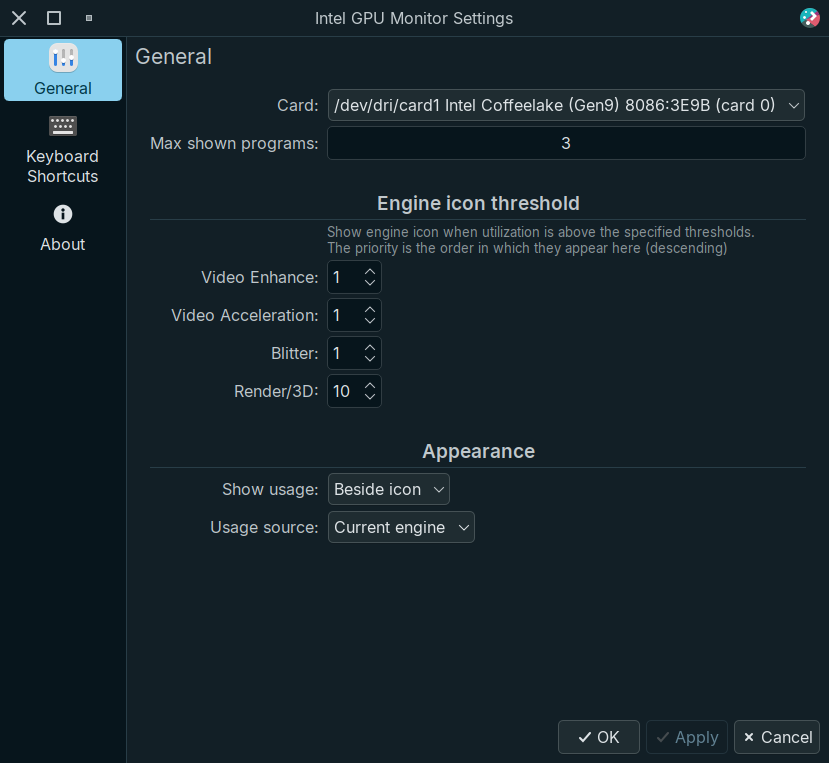

# Intel GPU Monitor plasmoid (WIP)

Plasma Widget that displays Intel GPU usage including wether or not video acceleration is being used

## Screenshots


<details>
    <summary>More</summary>

Settings



Tooltip


</details>

## Requirements

* [intel-gpu-tools](https://gitlab.freedesktop.org/drm/igt-gpu-tools) package

* Giving `intel_gpu_top` the ability to use performance monitoring features using `sudo setcap cap_perfmon=+ep /usr/bin/intel_gpu_top` every reboot, or you can use the following Systemd Unit

1. Create `/etc/systemd/system/setcap_intel_gpu_top.service` with the following:

    ```sh
    [Unit]
    Description=Set intel_gpu_top perfmon capabilities
    After=graphical.target

    [Service]
    ExecStart=/sbin/setcap cap_perfmon=+ep /usr/bin/intel_gpu_top
    Type=oneshot
    RemainAfterExit=yes

    [Install]
    WantedBy=graphical.target
    ```

2. Start & enable it

    ```sh
    sudo systemctl enable --now setcap_intel_gpu_top.service
    ```

## Current & planned features

* [x] Show General usage
  * [x] Load, Frequency, Power consumption
  * [x] Usage per engine (`Render/3D`, `Video & VideoEnhance`, `Blitter`)
* [x] Show top clients (program names) per engine
  * [x] Custom max clients (program names) to show in engine utilization
* [x] GPU selection
* [ ] Custom icons support
* [ ] Show current engine load
  * [ ] With badge
  * [x] With color dot
* [x] Custom engine utilization threshold to update icons

## Installing

* Install from [KDE Store](https://store.kde.org/p/2101680) or use `Get new widgets..`

### Manual install

* Install dependencies (please let me know if I missed or added something unnecessary)

  ```txt
    cmake extra-cmake-modules plasma-framework intel-gpu-tools
  ```

* Install the plasmoid

  ```sh
  ./install.sh
  ```

## How does it work?

* Reads Intel gpu stats using [intel_gpu_top](https://gitlab.freedesktop.org/drm/igt-gpu-tools)

## Resources

* [drm/igt-gpu-tools](https://gitlab.freedesktop.org/drm/igt-gpu-tools)
* [setcap(8) — Linux manual page](https://man7.org/linux/man-pages/man8/setcap.8.html)
* [No API/user accessible sysfs files to get GPU stats - drm/intel](https://gitlab.freedesktop.org/drm/intel/-/issues/5018)

## Credits

* [Google LLC. / Pictogrammers](https://pictogrammers.com/library/mdi/) for the panel icons
